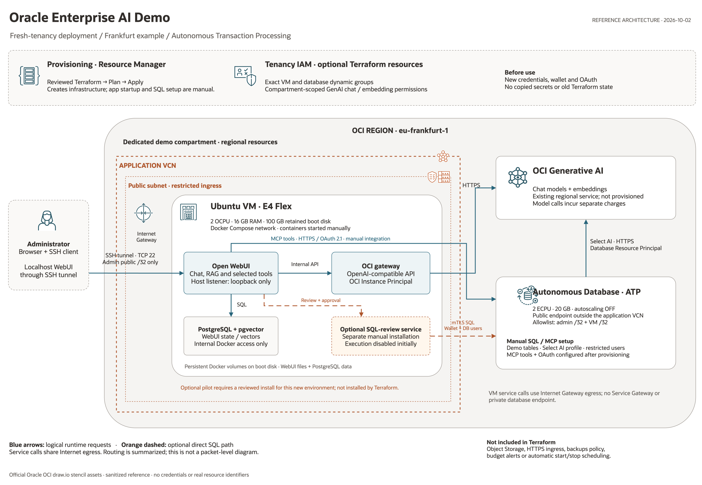

# Oracle Enterprise AI — deploy in your own environment

Sanitized OCI gateway source code, configuration templates, and a SQL/MCP demo.
**No original account credentials, wallets, keys, passwords, conversations, or business data are included.**
Use your own OCI account, resource identifiers, and credentials.

This is a development/demo package, **not a complete backup of the running system
or a security-certified production solution**. The Compose file is a new template
for a fresh environment, not an export from the original VM. Do not apply it over
an existing installation.

## Contents

- `oci-gateway/app.py`: an OpenAI-compatible gateway to OCI GenAI, with five chat
  models, native function calling, and Cohere embeddings. The gateway itself does not execute tools.
- `compose.example.yaml`, `.env.example`: Open WebUI + PostgreSQL + the gateway.
- `sql/projects/`: 12 fictional projects and a restricted lookup by project code.
- `sql/analytics/`: five demo tables, Select AI, and an MCP **SQL proposal tool with no execution**.
- `approved-sql/`: optional, separate administrator pilot for **exact-SQL review
  and one-use approval before read-only execution**; disabled by default, manual installation.
- `sql/bootstrap/`: initial setup steps for your own Autonomous Database.
- `config/`: IAM and MCP templates without original environment identifiers.
- `scripts/`: local secret generation, configuration validation, and sharing checks.
- `docs/`: setup, database/MCP instructions, security, provenance, and validation results.
- `infra/resource-manager/`: Terraform Stack and English Console form for a new
  OCI demo environment; application startup and SQL/OAuth setup stay manual.

Documentation, prompts, messages, and descriptive sample data are in English.
Existing database/tool identifiers and stored category codes are retained for
compatibility; see the [data code glossary](docs/DATABASE-MCP.md#data-code-glossary).

## Architecture



[Editable draw.io diagram](docs/architecture/enterprise-ai-atp.drawio) ·
[Architecture notes and scope](docs/architecture/README.md)

The diagram uses official Oracle OCI stencils. Blue paths show the manually
configured application and MCP flows; orange dashed paths show the optional
SQL-review pilot, which Terraform does **not** install or enable.

## Provision a new environment with OCI Resource Manager

[](https://cloud.oracle.com/resourcemanager/stacks/create?zipUrl=https%3A%2F%2Fgithub.com%2Fkwalter555%2Foracle-enterprise-ai%2Farchive%2Frefs%2Fheads%2Fmain.zip)

**Before continuing: turn off “Run apply”, select working directory
`infra/resource-manager`, and run Plan first.** The button opens the OCI Console;
it is not permission to deploy paid resources. Sign in to your own tenancy and
choose your intended region and compartment. The database ADMIN password enters
protected Terraform state when deployed; restrict access to that state.

The button downloads the **complete public `main` branch**, not this preview
branch. It is ready only after this change is merged into `main`. For a reviewed,
fixed version, upload a ZIP built from that exact commit instead of mutable `main`.
See the [button and ZIP instructions](infra/resource-manager/README.md#deploy-button-public-github-repository).

Use the [Stack guide](infra/resource-manager/README.md) to create fresh network,
Compute, Autonomous Database and optional IAM resources in your own compartment.
Upload the complete distribution ZIP and select working directory
`infra/resource-manager`. **Review Plan before Apply: these are paid resources.**
No existing environment is imported or modified. This prepares infrastructure,
not a one-click restoration of the original system.

The **2026-10-02 ATP package** corrects the earlier Stack's DW/20 GB mismatch:
new databases now use Transaction Processing (`OLTP`), 2 ECPUs and 20 GB by
default. Use a new Stack, not an in-place update to an existing database. No
automatic shutdown schedule or spending cap is installed; see the Stack guide.

## Alternative quick start — on your own new OCI Compute instance

For adding approved execution to an **existing** installation, use the separate
[approved SQL runbook](approved-sql/README.md), not this fresh-install procedure.

Prerequisites: your own OCI tenancy, a supported GenAI region and quotas, a Linux
VM, Docker Engine with Compose v2, Python 3, and administrative access to a new
Autonomous Database if you want the SQL demo. The gateway uses **OCI Instance
Principal**, not an API-key file or wallet. This authentication will not initialize
on an ordinary Mac or PC outside OCI Compute.

1. Read the [setup guide](docs/SETUP.md) and configure IAM using `config/iam-policy.example.txt`.
2. Run `python3 scripts/init_env.py`. It creates a Git-ignored `.env` with fresh
   secrets and permissions 0600, without printing values or overwriting an existing file.
3. Edit `.env` locally: set your compartment OCID, region, and WebUI address.
4. Run `python3 scripts/check_config.py`.
5. On that new VM, run:

   ```bash
   docker compose --env-file .env -f compose.example.yaml config --quiet
   docker compose --env-file .env -f compose.example.yaml up -d --build
   docker compose --env-file .env -f compose.example.yaml ps
   ```

6. Access WebUI through an SSH tunnel to `127.0.0.1:3000`, create the first admin
   account, and test chat. See [SETUP](docs/SETUP.md) for details and how to disable sign-ups.
7. SQL/MCP setup is separate and optional: [DATABASE-MCP](docs/DATABASE-MCP.md).

Models and image tags match the original demo; check availability in your region
before making billable calls. This package does not automatically upgrade libraries.
Google models may process data outside OCI; assess the terms, region, and data
suitability before use. The owner of the new account is responsible for charges.

## Checks without OCI calls

```bash
python3 scripts/check_share.py
python3 -m unittest discover -s tests -v
python3 sql/analytics/test_demo.py
python3 sql/analytics/test_proposal_artifacts.py
```

For gateway tests in an isolated Python 3.12 environment:

```bash
python3.12 -m venv .venv
.venv/bin/python -m pip install -r oci-gateway/requirements.txt
.venv/bin/python oci-gateway/offline_tests.py
```

Installing dependencies requires network access. The test runner itself blocks
socket/DNS calls and uses only synthetic HTTP responses.
See [validation results and limitations](docs/VALIDATION.md).

## Before committing or pushing

```bash
python3 scripts/check_share.py
git status --short
git diff --check
```

Then explicitly stage the reviewed files, inspect the staged diff, and repeat the
check. **Never use `git add -f` for secrets.** Commit only reviewed source files,
not your entire workspace or a VM backup directory. The automated check is a
heuristic, not a guarantee that all secrets are absent. History matters too:
`.gitignore` does not remove credentials committed earlier.

This package does not transfer rights to OCI, Open WebUI, or other dependencies.
Their licenses and terms apply separately. A license for sharing the owner's code
has not been selected; choose one before public release or granting redistribution rights.
